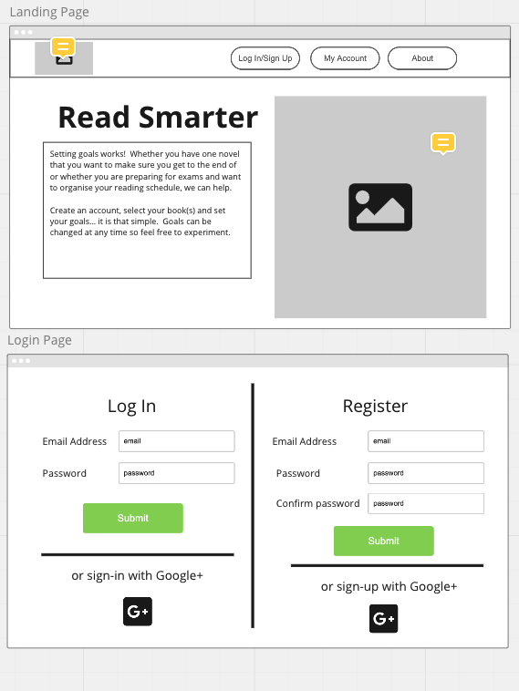
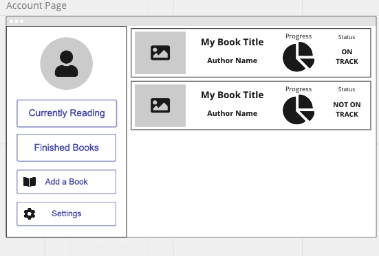
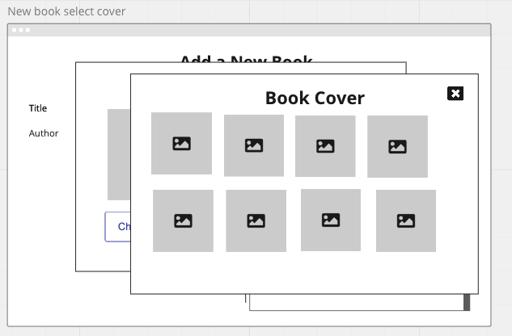
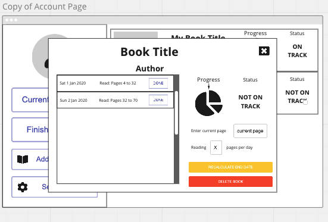
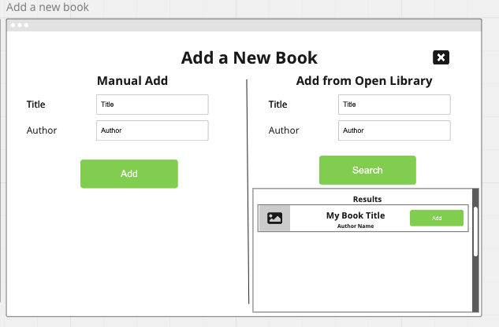
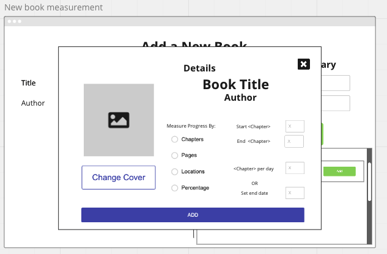

# My Reading Hub

A web app that allows users to create reading plans for themselves and to keep track of theior reading by updating their plans each day.

## Project Status
21/07/2021 - Version 1 Deployed on Heroku.

## Installation and Setup
This module is distributed via [npm][npm] which is bundled with [node][node] and
should be installed as one of your project's `dependencies`.

To run, you will also need to install the following dependencies in the root folder:

- axios
- bcryptjs
- body-parser
- cors
- dotenv
- express
- googleapis
- jsonwebtoken
- nodemailer
- pg

The client folder also has the following depedencies:
- axios
- react
- redux
- redux-persist

The database is written in postgresql.

## Design

Wireframing via 'Miro'.  The following sets out the basic design to be used in the app.

## Database

The database can be viewed at: https://dbdiagram.io/d/60dc8165dd6a59714826bde4 

Below is a copy of the database tables:

## Functionality

Users can:

- Create an account by registering.  Users will then be sent a verification link to verify their email address
- Find books via Google Books or enter them manually.  After which they can generate a reading plan for their selected book based on a number of parameters
- Update their progress each day and can amend their plan manually
- Recalculate plans based on current progress
- Change passwords and email address
- Delete individual or all plans
- Delete account

## Licence

MIT
